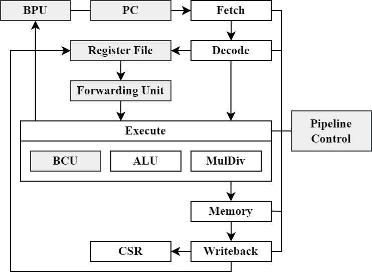
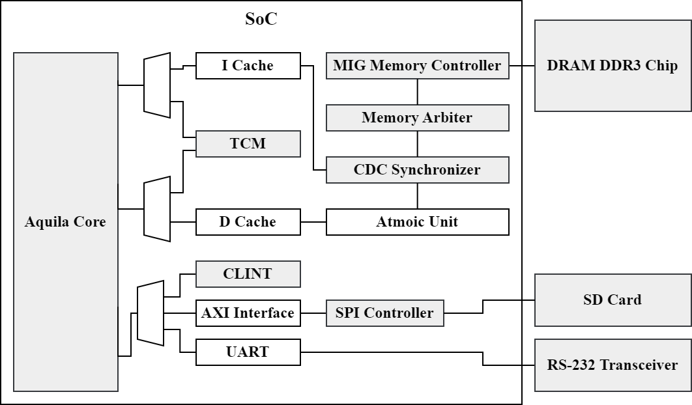

# Aquila 64 Hardware

###### tags"`aquila`, `soc`

# Introduction

此文章介紹 64 位元的 Aquila 處理器（dram 版本）相比 32 位元處理器（以下稱為原版）進行的修改。在 Hardware 路徑中的 3 個版本， tcm 版本和 dram 版本相比只差在缺乏快取以存取記憶體，此外皆相同。

此文章同樣公開於 hackmd ：

# Processor Core

> 此段落包含 `core_top.v` 和其 submodule 的行為。

根據 SPEC 說明， 32 位元指令幾乎相容於 64 位元。差別在於將 32 位元的運算元與結果符號擴展至 64 位元。然而 32 位元的資料至今仍是主流，因此必須有支援這些操作的指令。處理器核心的修改著重在支援 64 位元的指令。

Processor core 的 block diagram ，灰色部分代表沒有顯著修改：


## Program Counter

64 位元 Aquila 產生 64 位元的位址，不過目前處理器實際會使用的只有低 32 位元。

## Fetch

Fetch stage 負責接收並發射指令，在 program counter 產生位址後便會透過 address bus 向外部的記憶體裝置存取資料。

SPEC 規範 32 或 64 位元系統的指令都是 32 位元大小。在匯流排修改為 64 位元後， Fetch stage 一個週期會拿到 2 條指令，透過 PC 決定應該發射哪一條。目前設計在每一周期都會向記憶體索求指令。

## Decode

SPEC 中將指令的 `opcode` 欄位依據 `[6:5]` 和 `[4:2]` 兩部分劃分為數種指令。 64 位元系統新增了兩種類型： `OP_32` 和 `OP_IMM_32` ，用以支援 32 位元的資料。這會影響 I 和 M 指令子集， A 子集則透過 `funct3` 欄位得知資料大小。

Decode stage 負責產生立即值，在 64 位元的系統下立即值必須符號擴展至 64 位元。此外， Decode stage 也產生暫存器檔案的的寫入信號，此處需要額外增加 64 位元的類型。

另一個 Decode stage 負責的是指令的合法性。在 dram 版本中，非法指令只有未支援的 `fence` 和 `ebreak` 兩種這些指令也不會引起例外。。

## Execute

Execute stage 負責將運算元送入 ALU 並取得結果。為了支援新的指令，此階段會處理運算元和結果的符號或零擴展。

Execute stage 也負責處理分支指令，然而這部分在 64 位元系統並未做出修改。

### ALU

ALU 的大多數指令僅需調整運算元寬度即可執行新指令。少數的例外是移位指令，因為移位實用以填補的位元不同，且需要標示運算元大小的信號。

### MulDiv

乘除法的運算和 I 指令集相比，多了無號指令（`divuw`、`remuw`）。因此必須在乘除法電路中額外進行零擴展的檢查。此後便可使用原有的乘除法器。

`mulw` 是 32 位元指令中唯一的乘法指令，他會產生 64 位元的資料並在 execute 電路中取低 32 位元並進行符號擴展。其他 32 位元除法指令也類似。

## Memory

Memory 負責兩個工作：將資料對齊並送往記憶體，和從記憶體擷取資料。因此修改著重在解碼電路：

- 雙字組資料對齊 `0b000`
- 字組對齊 `0b00`
- 半字組對齊 `0b0`
- 位元組則可以放置在任意地方

## Writeback

Writeback 階段會針對不同指令將指定大小的資料寫回暫存器。此處要針對 32 和 64 位元大小的資料修改電路。

## Forwarding Unit

這個電路不需要明顯的修改，只要調整 XLEN 。

## CSR

我翻閱了 SPEC ，但是沒有找到明確說明暫存器寬度和 CSR 寬度的關係，找到的幾個說明：

1. XLEN 和 MXLEN 、 SXLEN 、 UXLEN 可以不同，此時 CSR 的值會被截取低處位元填入暫存器，或是將暫存器值符號擴展至 CSR 寬度。
2. XLEN 不得大於 MXLEN ，但是可以在較低的權限中小於 MXLEN 。

不過部分暫存器在 64 位元系統需要 MXLEN 為 64 ，例如 `mtvec` 和 `mepc` 等，因此實作 MXLEN = SXLEN = UXLEN = 64 。

CSR 的修改參考 The RISC-V Instruction Set Manual: Volume II. Privileged Architecture （20240411版本）。原版 Aquila 實作的 CSR 可能參考較早期的規範，有些內容如今已經被刪除或是修改。

目前的 CSR 可能有部分 CSR 未更新到新版的規範。

## Register File

這個電路不需要明顯的修改，只要調整 XLEN 。

## Pipeline Controll

這個電路不需要明顯的修改，只要調整 XLEN 。

# Aquila Top

此段落包含 `aquila_top.v` 和其 submodule 的行為。

## TCM

TCM 以 `sram_dp.v` 的電路合成，提供同步的讀寫記憶體。

`sram_dp.v` 電路的特別處在於以特定數量的位元作為儲存單位，例如在原版的 Aquila 中，這個大小是 32 ，因此 1 個位址可以取得 32 位元的資料。改為 64 位元後，儲存單位也擴展至 64 位元，也因此修改為擷取位址的 `[XLEN-1 : 3]` 作為索引。

改為 64 為原為儲存單位後， verilog header 檔案需要修改 TCM 的大小。另外紀錄： 64 位元的 Dhrystone benchmark 已經超過 64 KiB 的位址範圍。

## Cache

Arty A7 開發板提供的記憶體控制器提供 128 位元的傳輸寬度，使得 1 個 cache line 就是 128 位元。在 32 位元系統是 4 個字組， 64 位元系統則是 2 個雙字組，因此需要調整解碼電路。原版使用固定的常數計算 cache line 的 offset 和 index ，64 位元版本則使用 XLEN 計算。

資料快取的修改更複雜，因為要支援寫入，相當於讀取和寫入都要考慮資料的排列，類似再 memory stage 進行的處理。

Aquila 的快取針對另一個開發版（KC705）有不同大小的 cache line ，對應的解碼電路並未修改，如欲部屬在 KC705 開發版上需要注意。

## Atomic Unit

> riscv-test 中針對 AMO 指令的測試， lrsc.S 似乎沒有測試雙字組版本的指令，可能有潛在的錯誤。

Atomic Unit 的改動較大。

原版的 Atomic Unit 將運算後的資料放在 cache line 的高 32 位元處，並送往記憶體。這相當於讓它存取一個位址對齊 `0x0` 的 32 位元資料。此作法在 lrsc 的測試中會失敗，因此需要在 Atomic Unit 中新增排列資料的電路。

排列電路在資料快取中也有實作，但是原子指令需要運算後的資料，代表 Atomic Unit 需要另一個相同功能的電路。此處會遇到快取設計的一個影響：將字組以 big endian 的形式安排在 cache line 中，也就是原版的 cache line 如下文（ `word[i]` 使用的索引即 `line_offset` ）：

```
 127          96 95           64 63           32 31            0
+---------------+---------------+---------------+---------------+
|    word[0]    |    word[1]    |    word[2]    |    word[3]    |
+---------------+---------------+---------------+---------------+
```

因此在 64 位元系統，雙字組也以 big endian 排列。然而 RISC-V 本身採用 little endian ，因此在排序上考慮 6 種情況：

```
 127                          64 63                            0
+-------------------------------+-------------------------------+
|           dword[0]            |           dword[1]            |
+---------------+---------------+---------------+---------------+
|    word[1]    |    word[0]    |    word[3]    |    word[2]    |
+---------------+---------------+---------------+---------------+
 127          96 95           64 63           32 31            0
```

在資料快取中沒有遇到這樣的問題，是因為在 memory stage 先將雙字組的資料排列好，使資料快取只需處理 cache line 的排列。

Atomic Unit 的另一個修改，是針對 RV64A 的支援。運算如 ALU 一樣可以直接修改運算元的寬度，但需要如 execute 電路調整資料的大小。

## CLINT

原本的 memory-mapped registers 只有 32 位元，以 2 個暫存器提供 64 位元的功能。現在使用 3 個暫存器，並改為 64 位元的匯流排。

# SoC

此段落包含 `soc_top.v` 和其 submodule 的行為。

由於仍然採用 32 位元的位址， `soc_top.v` 中存取周邊裝置使用的位址無法再以 XLEN 計算獲得，而是以常數表示。

`soc_tb.v` 中有一個潛藏的 bug 。原有的 MIG 以 128 位元作為儲存單位。但使用的索引依然是 64 位元位址，這與處理器的設計不符，在模擬時可能會有未預期的錯誤。目前 MIG 被修改為會在電路內部擷取所需的位址欄位。

SoC 的 block diagram ：


## UART

UART 在修改為 64 位元匯流排之後， rx 和 tx 暫存器會同時被存取，因此讀取暫存器的位址需要修改。

## SPI Controller

axi_quad_spi 電路只有提供最多 32 位元的傳輸介面。不過驅動程式實際只有使用位元組作為傳輸單位（`spi_txrx()` 接受 `unsigned char` 作為參數）。而寫入暫存器的資料也以整數為型別，這代表著不修改驅動的情況下，程式將以 `lw/sw` 作為存取 SPI 的指令。

最簡單的作法是不修改驅動，電路只會回傳 32 位元的有效資料。目前的作法是將其填入匯流排的高低兩部分。

# 資源使用

使用 Vivado 2024.1 在 xc7a100t FPGA 合成 clock rate 50 MHz 。

| Resource | percentage | number | total  |
| :------- | :--------- | :----- | :----- |
| LUT      | 28.82      | 18271  | 63400  |
| LUTRAM   | 5.79       | 1101   | 19000  |
| FF       | 10.95      | 13887  | 126800 |
| BRAM     | 27.41      | 37     | 135    |
| DSP      | 6.67       | 16     | 240    |
| IO       | 28.57      | 60     | 210    |
| BUFG     | 15.63      | 5      | 32     |
| MMCM     | 33.3       | 2      | 6      |
| PLL      | 16.67      | 1      | 6      |

功率： 0.961 W

# 測試結果：

```
-----------------------------------------------
Testing: rv64mi
Testcase: rv64mi-p-sbreak                failed
Testcase: rv64mi-p-mcsr                  passed
Testcase: rv64mi-p-ma_addr               passed
Testcase: rv64mi-p-zicntr                passed
Testcase: rv64mi-p-scall                 passed
Testcase: rv64mi-p-csr                   failed
Testcase: rv64mi-p-lh-misaligned         passed
Testcase: rv64mi-p-breakpoint            failed
Testcase: rv64mi-p-instret_overflow      passed
Testcase: rv64mi-p-ma_fetch              failed
Testcase: rv64mi-p-ld-misaligned         passed
Testcase: rv64mi-p-sd-misaligned         passed
Testcase: rv64mi-p-sw-misaligned         passed
Testcase: rv64mi-p-pmpaddr               passed
Testcase: rv64mi-p-sh-misaligned         passed
Testcase: rv64mi-p-lw-misaligned         passed
Testcase: rv64mi-p-illegal               passed

Total case: 17 pass: 13 fail: 4
-----------------------------------------------
Testing: rv64si
Testcase: rv64si-p-sbreak                failed
Testcase: rv64si-p-dirty                 failed
Testcase: rv64si-p-scall                 passed
Testcase: rv64si-p-wfi                   passed
Testcase: rv64si-p-icache-alias          passed
Testcase: rv64si-p-ma_fetch              failed
Testcase: rv64si-p-csr                   passed

Total case: 7 pass: 4 fail: 3
-----------------------------------------------
Testing: rv64ui
Testcase: rv64ui-p-lbu                   passed
Testcase: rv64ui-p-slt                   passed
Testcase: rv64ui-p-sd                    passed
Testcase: rv64ui-p-srai                  passed
Testcase: rv64ui-p-srl                   passed
Testcase: rv64ui-p-ld_st                 passed
Testcase: rv64ui-p-addiw                 passed
Testcase: rv64ui-p-fence_i               failed
Testcase: rv64ui-p-sub                   passed
Testcase: rv64ui-p-lb                    passed
Testcase: rv64ui-p-simple                passed
Testcase: rv64ui-p-sltu                  passed
Testcase: rv64ui-p-slliw                 passed
Testcase: rv64ui-p-lhu                   passed
Testcase: rv64ui-p-lwu                   passed
Testcase: rv64ui-p-blt                   passed
Testcase: rv64ui-p-ori                   passed
Testcase: rv64ui-p-slti                  passed
Testcase: rv64ui-p-bge                   passed
Testcase: rv64ui-p-xori                  passed
Testcase: rv64ui-p-addi                  passed
Testcase: rv64ui-p-sh                    passed
Testcase: rv64ui-p-or                    passed
Testcase: rv64ui-p-sllw                  passed
Testcase: rv64ui-p-andi                  passed
Testcase: rv64ui-p-ld                    passed
Testcase: rv64ui-p-add                   passed
Testcase: rv64ui-p-bltu                  passed
Testcase: rv64ui-p-auipc                 passed
Testcase: rv64ui-p-bne                   passed
Testcase: rv64ui-p-addw                  passed
Testcase: rv64ui-p-xor                   passed
Testcase: rv64ui-p-srli                  passed
Testcase: rv64ui-p-sra                   passed
Testcase: rv64ui-p-beq                   passed
Testcase: rv64ui-p-bgeu                  passed
Testcase: rv64ui-p-subw                  passed
Testcase: rv64ui-p-st_ld                 passed
Testcase: rv64ui-p-sw                    passed
Testcase: rv64ui-p-sraiw                 passed
Testcase: rv64ui-p-sll                   passed
Testcase: rv64ui-p-jal                   passed
Testcase: rv64ui-p-sb                    passed
Testcase: rv64ui-p-and                   passed
Testcase: rv64ui-p-ma_data               failed
Testcase: rv64ui-p-jalr                  passed
Testcase: rv64ui-p-lw                    passed
Testcase: rv64ui-p-sltiu                 passed
Testcase: rv64ui-p-slli                  passed
Testcase: rv64ui-p-lui                   passed
Testcase: rv64ui-p-sraw                  passed
Testcase: rv64ui-p-srliw                 passed
Testcase: rv64ui-p-lh                    passed
Testcase: rv64ui-p-srlw                  passed

Total case: 54 pass: 52 fail: 2
-----------------------------------------------
Testing: rv64um
Testcase: rv64um-p-remw                  passed
Testcase: rv64um-p-mulhsu                passed
Testcase: rv64um-p-div                   passed
Testcase: rv64um-p-mulw                  passed
Testcase: rv64um-p-remuw                 passed
Testcase: rv64um-p-rem                   passed
Testcase: rv64um-p-mul                   passed
Testcase: rv64um-p-divw                  passed
Testcase: rv64um-p-remu                  passed
Testcase: rv64um-p-divuw                 passed
Testcase: rv64um-p-mulh                  passed
Testcase: rv64um-p-divu                  passed
Testcase: rv64um-p-mulhu                 passed

Total case: 13 pass: 13 fail: 0
-----------------------------------------------
Testing: rv64ua
Testcase: rv64ua-p-amoand_w              passed
Testcase: rv64ua-p-amomaxu_d             passed
Testcase: rv64ua-p-amoxor_w              passed
Testcase: rv64ua-p-amoadd_w              passed
Testcase: rv64ua-p-amomax_d              passed
Testcase: rv64ua-p-amoor_d               passed
Testcase: rv64ua-p-amoor_w               passed
Testcase: rv64ua-p-amominu_w             passed
Testcase: rv64ua-p-amomin_d              passed
Testcase: rv64ua-p-lrsc                  passed
Testcase: rv64ua-p-amoand_d              passed
Testcase: rv64ua-p-amominu_d             passed
Testcase: rv64ua-p-amoswap_w             passed
Testcase: rv64ua-p-amoswap_d             passed
Testcase: rv64ua-p-amoxor_d              passed
Testcase: rv64ua-p-amomaxu_w             passed
Testcase: rv64ua-p-amomax_w              passed
Testcase: rv64ua-p-amoadd_d              passed
Testcase: rv64ua-p-amomin_w              passed

Total case: 19 pass: 19 fail: 0
```